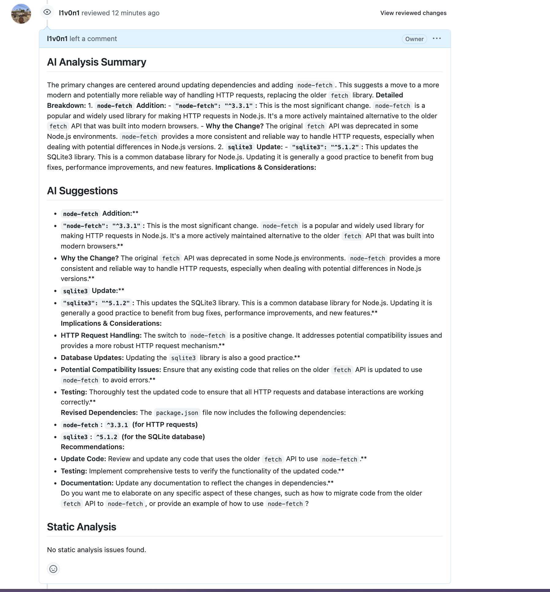

# ReviewBuddy

ReviewBuddy is an AI-powered code review assistant that helps developers get better code reviews faster. It combines static analysis tools with AI to provide comprehensive feedback on pull requests.

## Features

- 🤖 AI-powered code analysis using Ollama or OpenAI API
- 🔍 Static code analysis with Pylint, Flake8, and ESLint
- 📝 Automated pull request reviews
- ⚡ Fast and efficient analysis
- 🔒 Secure handling of API keys and tokens
- 🎯 Configurable analysis settings

## Example Review

Here's an example of ReviewBuddy in action:



## Installation

1. Clone the repository:
```bash
git clone https://github.com/l1v0n1/reviewbuddy.git
cd reviewbuddy
```

2. Install dependencies:
```bash
pip install -r requirements.txt
```

3. Configure ReviewBuddy:
   - Copy `.reviewbuddy.yml.example` to `.reviewbuddy.yml`
   - Edit the configuration file with your settings

## Usage

### Local Development

1. Start Ollama (if using local AI):
```bash
ollama serve
ollama pull llama3
```

2. Run ReviewBuddy:
```bash
python -m src.main
```

### GitHub Actions

Add this to your `.github/workflows/reviewbuddy.yml`:

```yaml
name: ReviewBuddy

on:
  pull_request:
    types: [opened, synchronize]

jobs:
  review:
    runs-on: ubuntu-latest
    steps:
      - uses: actions/checkout@v2
      - name: Run ReviewBuddy
        uses: l1v0n1/reviewbuddy@v1
        with:
          github-token: ${{ secrets.GITHUB_TOKEN }}
          config-path: .reviewbuddy.yml
```

## Configuration

ReviewBuddy can be configured using a `.reviewbuddy.yml` file:

```yaml
ai:
  provider: ollama  # or 'api'
  ollama:
    model: llama3
    base_url: http://localhost:11434
  api:
    api_key: $REVIEWBUDDY_API_KEY
    api_url: https://api.openai.com/v1/chat/completions
    model: gpt-4

static_analysis:
  severity_threshold: warning
  tools:
    - pylint
    - flake8
    - eslint
```

## Contributing

Contributions are welcome! Please feel free to submit a Pull Request.

## License

This project is licensed under the MIT License - see the [LICENSE](LICENSE) file for details. 